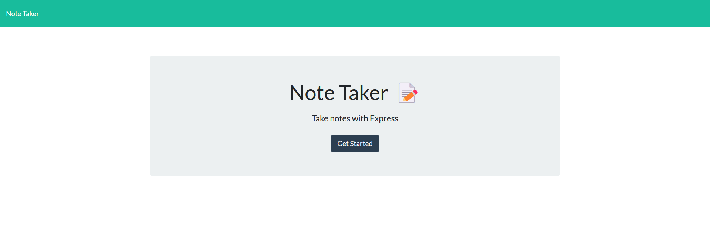
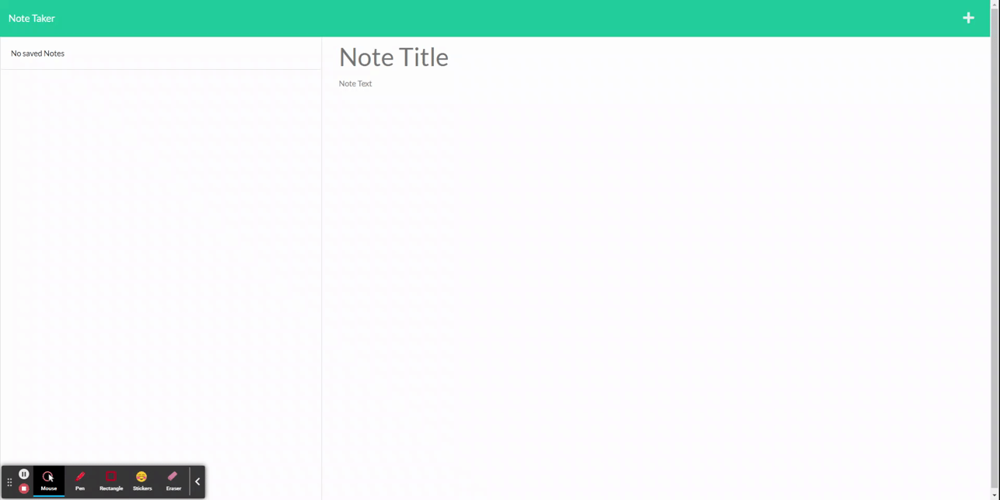
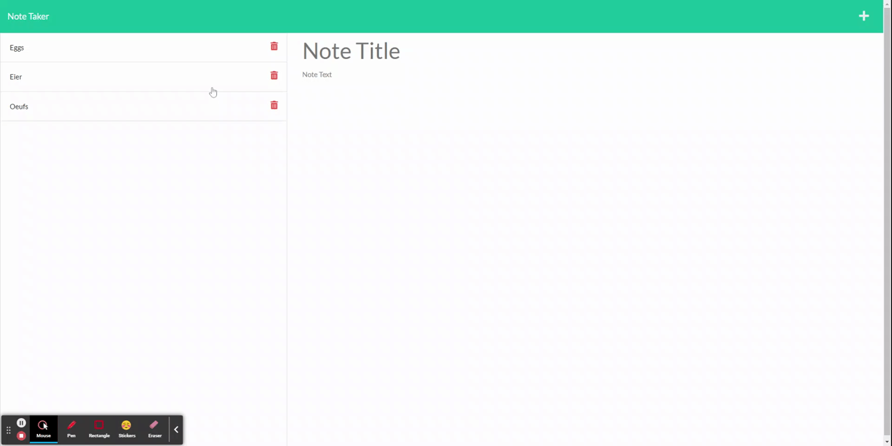
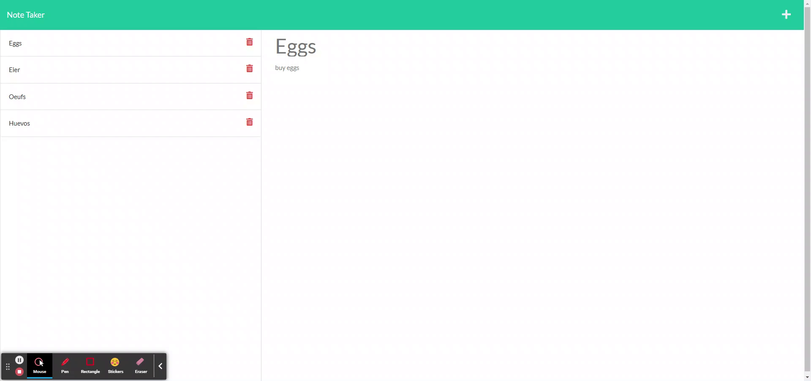

# Note Taker

## Description
Simple [application](https://jsardinas-note-taker.herokuapp.com/) using express.js to create, save and delete notes that persist on the server.

## Table of Contents
- [Installation](#installation)
- [Usage](#usage)
- [License](#license)
- [Contributing](#contributing)
- [Tests](#tests)
- [Questions](#questions)

## Installation
- Navigate to where `package.json` is and type `npm install` to install the dependencies.
- Type `npm start` to start the server.

## Usage
Go to the [website](https://jsardinas-note-taker.herokuapp.com/) where the app is deployed and start taking notes. 

Click on the `+` button to add a new note.

Click on the delete button to delete a note

## License

This application is covered under ISC license.

## Contributing
The repo is public, anyone can submit pull requests.

## Tests
No tests were included.

## Questions

#### Contact Me

[ jsardinas](http://github.com/jsardinas) on Github 

[:email: javier.sardinas@gmail.com](mailto:javier.sardinas@gmail.com)

  

Made with [Markdown Generator](https://github.com/jsardinas/mdgen)
